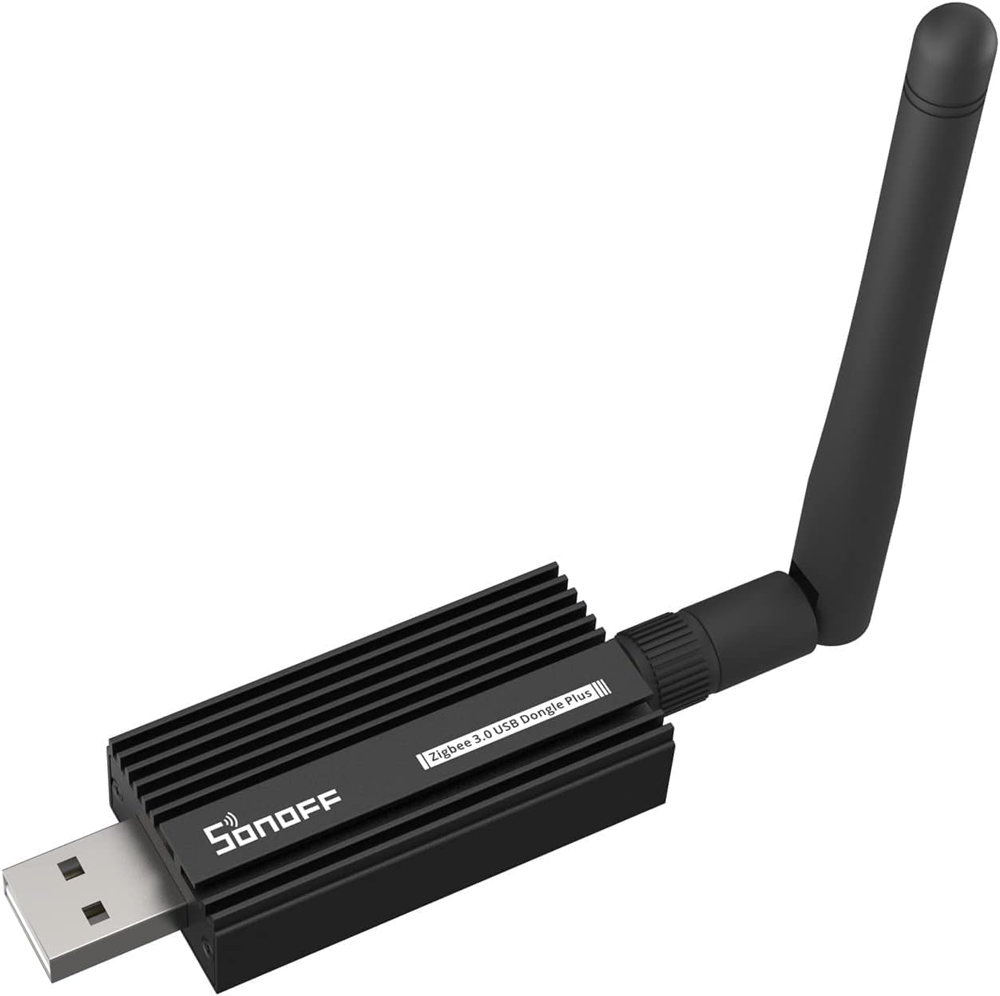

<h1 align="center">HomeAssistant config</h1>

  This is a project focused on sharing ideas and solutions for the use of <a href="https://www.home-assistant.io/">Home Assistant</a> and home automation in general.

  
  
  
  

  
  
  
  

## Table of Contents

- [Screenshots](#screenshots)
- [Software](#software)
- [Integrations](#integrations)
- [Lovelace Cards](#lovelace-cards)
- [Addons](#addons)
- [Devices](#devices)
- [Automations](#automations)
- [ToDo list](#todo-list)

## Screenshots

### Dashboard Home

- Device tracker
- Phone status (location)

## Software

- [HomeAssistant](https://www.home-assistant.io/) MQTT server to communicate with devices
- [MariaDB](https://mariadb.org/) database to save all information
- [VSCode](https://code.visualstudio.com/) server to code in browser

## Integrations

  
Show full list

  
 

- [rpi_power](https://www.home-assistant.io/integrations/rpi_power/)
- [google_translate](https://www.home-assistant.io/integrations/google_translate/)
- [HACS](https://www.home-assistant.io/integrations/hacs/)
- [local_calendar](https://www.home-assistant.io/integrations/local_calendar/)
- [mobile_app](https://www.home-assistant.io/integrations/mobile_app/)
- [cast](https://www.home-assistant.io/integrations/cast/)
- [cloud](https://www.home-assistant.io/integrations/cloud/)
- [webostv](https://www.home-assistant.io/integrations/webostv/)
- [tessie](https://www.home-assistant.io/integrations/tessie/)
- [samsungtv](https://www.home-assistant.io/integrations/samsungtv/)
- [dlna_dmr](https://www.home-assistant.io/integrations/dlna_dmr/)
- [mqtt](https://www.home-assistant.io/integrations/mqtt/)
- [zha](https://www.home-assistant.io/integrations/zha/)
- [local_todo](https://www.home-assistant.io/integrations/local_todo/)
- [template](https://www.home-assistant.io/integrations/template/)
- [shopping_list](https://www.home-assistant.io/integrations/shopping_list/)
- [scheduler](https://www.home-assistant.io/integrations/scheduler/)
- [systemmonitor](https://www.home-assistant.io/integrations/systemmonitor/)
- [octopus_energy](https://www.home-assistant.io/integrations/octopus_energy/)
- [spook](https://www.home-assistant.io/integrations/spook/)
- [ibeacon](https://www.home-assistant.io/integrations/ibeacon/)
- [openai_conversation](https://www.home-assistant.io/integrations/openai_conversation/)
- [go2rtc](https://www.home-assistant.io/integrations/go2rtc/)
- [chore_helper](https://www.home-assistant.io/integrations/chore_helper/)
- [pantry_tracker](https://www.home-assistant.io/integrations/pantry_tracker/)
- [music_assistant](https://www.home-assistant.io/integrations/music_assistant/)
- [asusrouter](https://www.home-assistant.io/integrations/asusrouter/)
- [ping](https://www.home-assistant.io/integrations/ping/)
- [unraid](https://www.home-assistant.io/integrations/unraid/)
- [google_generative_ai_conversation](https://www.home-assistant.io/integrations/google_generative_ai_conversation/)

## Lovelace Cards

  
Show full list

  
 

- [anchor-card](https://github.com/ShadowAya/anchor-card)
- [android-tv-card](https://github.com/ShadowAya/android-tv-card)
- [apexcharts-card](https://github.com/ShadowAya/apexcharts-card)
- [atomic-calendar-revive](https://github.com/ShadowAya/atomic-calendar-revive)
- [bar-card](https://github.com/ShadowAya/bar-card)
- [better-thermostat-ui-card](https://github.com/ShadowAya/better-thermostat-ui-card)
- [bootstrap-grid-card](https://github.com/ShadowAya/bootstrap-grid-card)
- [Bubble-Card](https://github.com/ShadowAya/Bubble-Card)
- [button-card](https://github.com/ShadowAya/button-card)
- [channel-pad](https://github.com/ShadowAya/channel-pad)
- [charger-card](https://github.com/ShadowAya/charger-card)
- [clock-weather-card](https://github.com/ShadowAya/clock-weather-card)
- [config-template-card](https://github.com/ShadowAya/config-template-card)
- [css-swipe-card](https://github.com/ShadowAya/css-swipe-card)
- [custom-brand-icons](https://github.com/ShadowAya/custom-brand-icons)
- [custom-icons](https://github.com/ShadowAya/custom-icons)
- [custom-more-info](https://github.com/ShadowAya/custom-more-info)
- [decluttering-card](https://github.com/ShadowAya/decluttering-card)
- [energy-gauge-bundle-card](https://github.com/ShadowAya/energy-gauge-bundle-card)
- [hass-room-card](https://github.com/ShadowAya/hass-room-card)
- [honeycomb-menu](https://github.com/ShadowAya/honeycomb-menu)
- [kiosk-mode](https://github.com/ShadowAya/kiosk-mode)
- [LG-WebOS-Remote-Control](https://github.com/ShadowAya/LG-WebOS-Remote-Control)
- [light-entity-card](https://github.com/ShadowAya/light-entity-card)
- [lovelace-auto-entities](https://github.com/ShadowAya/lovelace-auto-entities)
- [lovelace-card-mod](https://github.com/ShadowAya/lovelace-card-mod)
- [lovelace-collapsable-cards](https://github.com/ShadowAya/lovelace-collapsable-cards)
- [lovelace-expander-card](https://github.com/ShadowAya/lovelace-expander-card)
- [lovelace-fold-entity-row](https://github.com/ShadowAya/lovelace-fold-entity-row)
- [lovelace-horizon-card](https://github.com/ShadowAya/lovelace-horizon-card)
- [lovelace-layout-card](https://github.com/ShadowAya/lovelace-layout-card)
- [lovelace-mushroom](https://github.com/ShadowAya/lovelace-mushroom)
- [lovelace-paper-buttons-row](https://github.com/ShadowAya/lovelace-paper-buttons-row)
- [lovelace-plotly-graph-card](https://github.com/ShadowAya/lovelace-plotly-graph-card)
- [lovelace-slider-entity-row](https://github.com/ShadowAya/lovelace-slider-entity-row)
- [lovelace-template-entity-row](https://github.com/ShadowAya/lovelace-template-entity-row)
- [lovelace-time-picker-card](https://github.com/ShadowAya/lovelace-time-picker-card)
- [mini-graph-card](https://github.com/ShadowAya/mini-graph-card)
- [mini-media-player](https://github.com/ShadowAya/mini-media-player)
- [octopus-energy-rates-card](https://github.com/ShadowAya/octopus-energy-rates-card)
- [pantry_tracker_card](https://github.com/ShadowAya/pantry_tracker_card)
- [scheduler-card](https://github.com/ShadowAya/scheduler-card)
- [sidebar-card](https://github.com/ShadowAya/sidebar-card)
- [simple-weather-card](https://github.com/ShadowAya/simple-weather-card)
- [stack-in-card](https://github.com/ShadowAya/stack-in-card)
- [surveillance-card](https://github.com/ShadowAya/surveillance-card)
- [swipe-card](https://github.com/ShadowAya/swipe-card)
- [swiper-slider](https://github.com/ShadowAya/swiper-slider)
- [tv-card](https://github.com/ShadowAya/tv-card)
- [Ultra-Vehicle-Card](https://github.com/ShadowAya/Ultra-Vehicle-Card)
- [uptime-card](https://github.com/ShadowAya/uptime-card)
- [vertical-stack-in-card](https://github.com/ShadowAya/vertical-stack-in-card)
- [weather-card](https://github.com/ShadowAya/weather-card)

## Addons

  
Show full list

  
 

- [Advanced SSH & Web Terminal](https://github.com/hassio-addons/addon-ssh)
- [Cloudflared](https://github.com/brenner-tobias/addon-cloudflared/)
- [Samba share](https://github.com/home-assistant/addons/tree/master/samba)
- [Home Assistant Google Drive Backup](https://github.com/sabeechen/hassio-google-drive-backup)
- [Mosquitto broker](https://github.com/home-assistant/addons/tree/master/mosquitto)
- [Zigbee2MQTT](https://github.com/zigbee2mqtt/hassio-zigbee2mqtt/tree/master/zigbee2mqtt)
- [File editor](https://github.com/home-assistant/addons/tree/master/configurator)
- [Vaultwarden (Bitwarden)](https://github.com/hassio-addons/addon-bitwarden)
- [Uptime Kuma](https://github.com/hassio-addons/addon-uptime-kuma)
- [Node-RED](https://github.com/hassio-addons/addon-node-red)
- [Piper](https://github.com/home-assistant/addons/blob/master/piper)
- [RPC Shutdown](https://github.com/home-assistant/addons/tree/master/rpc_shutdown)
- [MariaDB](https://github.com/home-assistant/addons/tree/master/mariadb)
- [Duck DNS](https://github.com/home-assistant/addons/tree/master/duckdns)
- [Portainer](https://github.com/alexbelgium/hassio-addons)
- [Terminal & SSH](https://github.com/home-assistant/addons/tree/master/ssh)
- [Pantry Tracker](https://github.com/mintcreg/pantry_tracker)
- [Whisper](https://github.com/home-assistant/addons/blob/master/whisper)
- [Assist Microphone](https://github.com/home-assistant/addons/blob/master/assist_microphone)
- [openWakeWord](https://github.com/home-assistant/addons/blob/master/openwakeword)
- [Music Assistant Server (beta)](https://music-assistant.io)
- [MQTT Explorer](https://github.com/GollumDom/addon-repository) *(No URL provided)*

## Devices

<table align="center" border="0" width="100%">
  <thead>
    <tr>
      <th>Device</th>
      <th>Use</th>
      <th>Quantity</th>
    </tr>
  </thead>
  <tbody>
    <tr>
      <td>
        
        <h3>RPI 4 (8gb)</h3>
      </td>
      <td>
        
Directly running HASSIO OS

      </td>
      <td>x1</td>
    </tr>
    <tr>
      <td>
        
        <h3>ASUS RT-AC86U</h3>
      </td>
      <td>
        
Router

      </td>
      <td>x1</td>
    </tr>
    <tr>
      <td>
        
        <h3>SONOFF-Zigbee Plus-E</h3>
      </td>
      <td>
        
Zigbee co-ordinator

      </td>
      <td>x1</td>
    </tr>
    <tr>
      <td>
        
        <h3>Google Home Mini</h3>
      </td>
      <td>
        
Voice Assistant

      </td>
      <td>x2</td>
    </tr>
    <tr>
      <td>
        
        <h3>Ikea Vallhorn Motion Sensor</h3>
      </td>
      <td>
        
Capture motion

      </td>
      <td>x4</td>
    </tr>
    <tr>
      <td>
        
        <h3>Sonoff SNZB-02</h3>
      </td>
      <td>
        
Temperature Sensor

      </td>
      <td>x2</td>
    </tr>
    <tr>
      <td>
        
        <h3>Sonoff SNZB-02</h3>
      </td>
      <td>
        
Open/close sensor

      </td>
      <td>x3</td>
    </tr>
    <tr>
      <td>
        
        <h3>TUYA - TS0201</h3>
      </td>
      <td>
        
Fridge temperature sensor

      </td>
      <td>x1</td>
    </tr>
    <tr>
      <td>
        
        <h3>Tuya - TS0011</h3>
      </td>
      <td>
        
Light switch

      </td>
      <td>x9</td>
    </tr>
    <tr>
      <td>
        
        <h3>Tuya BSD29_1</h3>
      </td>
      <td>
        
Switch / Power meter

      </td>
      <td>x1</td>
    </tr>
    <tr>
      <td>
        
        <h3>Tuya - WSD500A</h3>
      </td>
      <td>
        
Temperature Sensor

      </td>
      <td>x3</td>
    </tr>
    <tr>
      <td>
        
        <h3>Tuya - ZG-227Z</h3>
      </td>
      <td>
        
Temperature Sensor

      </td>
      <td>x5</td>
    </tr>
    <tr>
      <td>
        
        <h3>Tuya - ZY-M100-24GV3</h3>
      </td>
      <td>
        
Presence sensor

      </td>
      <td>x2</td>
    </tr>
  </tbody>
</table>

## Automations

### Coming soon

## Secrets
You can find a complete list of secrets used on this project [here](secrets.example.yaml).

## ToDo list

- [ ] Add items to the to do list

